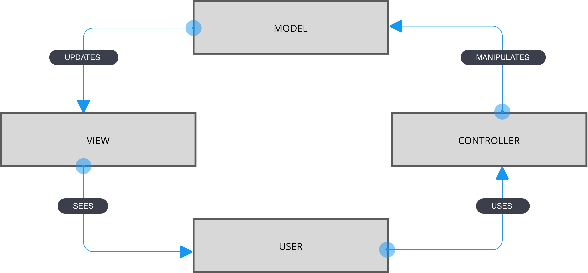

# STATE

## Notions nécessaires


## Nouvelles notions
- MVC / Modèle-vue-contrôleur

## Modèle-vue-contrôleur
- Un modèle (Model) contient les données à afficher.
- Une vue (View) contient la présentation de l'interface graphique.
- Un contrôleur (Controller) contient la logique concernant les actions effectuées par l'utilisateur.

L MVC permet d'éviter les effets de bord.



## Codes a tester
```
class TestState extends React.Component {
  constructor(props) {
    super(props);
    // définition du state, un simple litteral
    this.state = {
      count:0
    };
    // Update state
    setInterval(
      () => {
        this.setState({
          count : this.state.count + 1
        });
      }, 1000
    )
    console.log(this.state.count);
  }
  render() {
    return (
      <div>
      <p>Count: {this.state.count} </p>
      </div>
    );
  }
}
ReactDOM.render(<TestState />,document.getElementById('root'));
```
