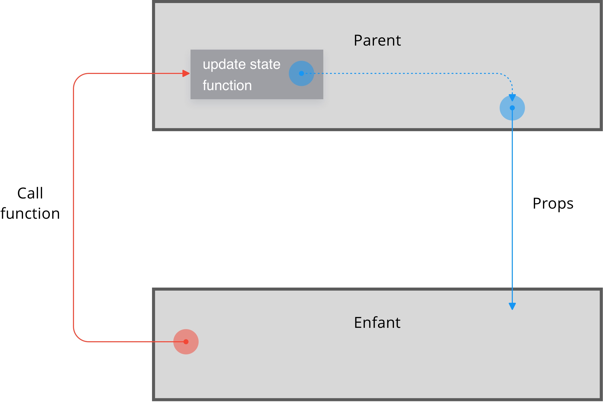

# LIFTUP STATE UP

## Notions nécessaires
- Form
- Input
- onChange
- onSubmit

## Nouvelles notions




## Codes a tester
```
class Parent extends React.Component{
  constructor(props){
    super(props);
    this.state = {text:"init"};
  }
  fctToCall = () => {
    this.setState({text : "Call from a child"})
  }
  render(){
    return(<Enfant parentFunction={this.fctToCall} text={this.state.text}/>)
  }
}

class Enfant extends React.Component{
  constructor(props){
    super(props);
  }
  componentDidMount(){
    setTimeout(() => {
      this.props.parentFunction();
    }, 2000);
  }
  render(){
    return(<h1>{this.props.text}</h1>)
  }
}

ReactDOM.render(<Parent/>, document.getElementById('root'));


```
