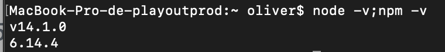

# GESTIOND DES STYLES

## Notions nécessaires
- terminal
- npm >= 5.6
- nodeJS  >= 8.10

## Nouvelles notions
- package.json
- Build /dev env
- [create-react-app](https://github.com/facebook/create-react-app)


## Codes a tester

### tester la version de npm & nodeJS
```
node -v;npm -v
```

Install npm : [Download link](https://nodejs.org/en/download/)

### installer create-react-app puis créer un initialiser un projet avec npm
```
npm install create-react-app --global
npx create-react-app my-app --use-npm
```
