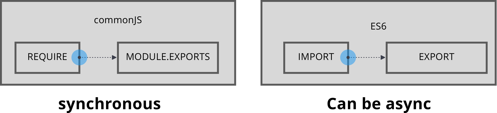

# DECOUPAGE DYNAMIQUE DE CODE

## Notions nécessaires
- ES6

## Nouvelles notions
- import / exports
- require / module.exports
- [webpack](https://webpack.js.org/)
- [babel](https://babeljs.io/)

### import vs require



Export par défaut
Uniquement des valeurs, fonctions ou classes.
```
import [name] from "path/to/file"
```
ou
```
import {default as [name]} from "path/to/file"
```

Export ciblé
Doit être typé, 1 seul export autorisé.
```
export function [name] = function(){};
export class [name]{};
export {[name]};
import {[name]} from "path/to/file"
```


## Codes a tester

### import
```
import exportParDefaut from "nom-module";

import * as nom from "nom-module";
import { export } from "nom-module";
import { export as alias } from "nom-module";

import "nom-module";

import React from 'react';
import logo from './logo.svg';
import './App.css';
```

### export
```
export default App;
export let nom1;
export function nomFonction(){...}
export class NomClasse {...}
```

###re-export
```
export * from 'src/other_module';
export { foo, bar } from 'src/other_module';
```

### require
```
var example = require('./example.js')

```

```
module.exports = function () {}
module.exports.myClass = MyClass
module.exports = {myClass : MyClass}
```
