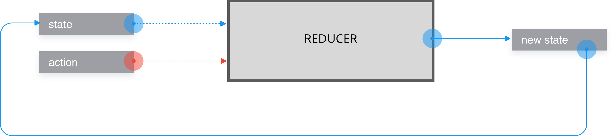

# HOOKS

## Notions nécessaires
- useState

## Nouvelles notions
- useReducer




## Codes a tester

```
const initialState = {count: 0};

const reducer = (state, action) => {
  switch (action.type) {
    case 'incr':
      return {count: state.count + 1};
    case 'decr':
      return {count: state.count - 1};
    default:
      return state;
  }
}

function Counter() {
  const [state, dispatch] = React.useReducer(reducer, initialState);
  return (
  <React.Fragment>
    Counter : {state.count}
    <button onClick={() => dispatch({type: 'decr'})}>-</button>
    <button onClick={() => dispatch({type: 'incr'})}>+</button>
  </React.Fragment>
  );
}

ReactDOM.render(<Counter/>, document.getElementById('root'));


```
