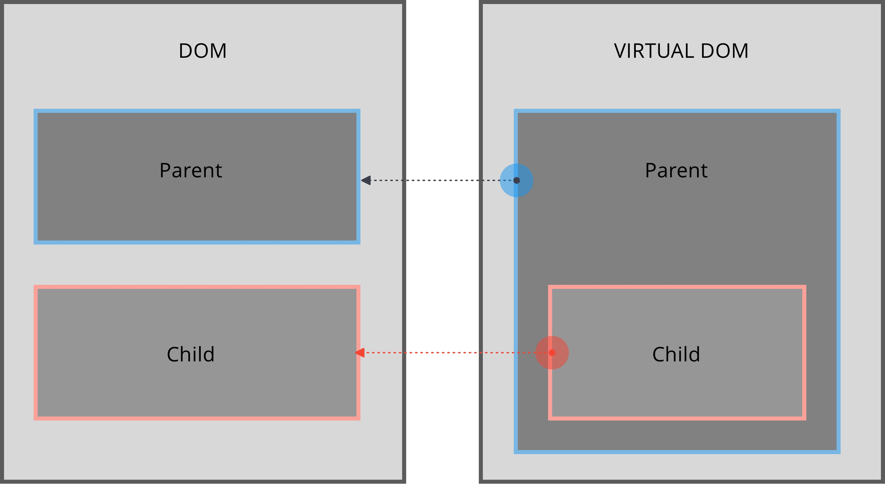

# PORTAILS

## Notions nécessaires
- DOM
- DOM Virtuel

## Nouvelles notions
- createPortal



## Codes a tester

```
const container = document.getElementById('root');
const modalRoot = document.getElementById('modal-root');

//Modal is a React component that can be attach to the DOM and display all childrens
const Modal = ({children}) => {
  const el = React.useRef(document.createElement('div'));
  // uniquement au montage
  React.useEffect(() =>{
    // on récupère l'élément dans la ref
    // et on le monte dans le noeud frère de root modal-root
    // dans le DOM
    modalRoot.appendChild(el.current);
      return () => { el.current.remove() ; }
    }, []);

  return (
    ReactDOM.createPortal(children,el.current)
  )
}

const ClickMe = () => (<button>click me</button>);

const App = () => {
  const [count, setCount] = React.useState(0);
  return (<React.Fragment>
    <p>{count}</p>
    <div onClick={ () => setCount(count + 1)}>
      <Modal>
        <ClickMe />
      </Modal>
    </div>
  </React.Fragment>);
}

ReactDOM.render(<App/>, container );

```
