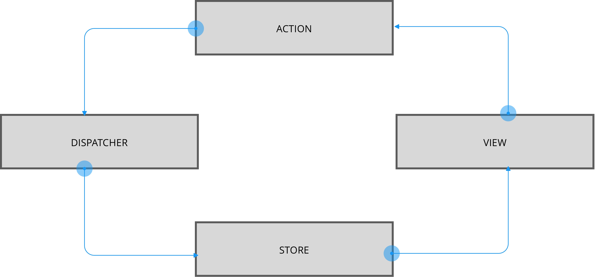
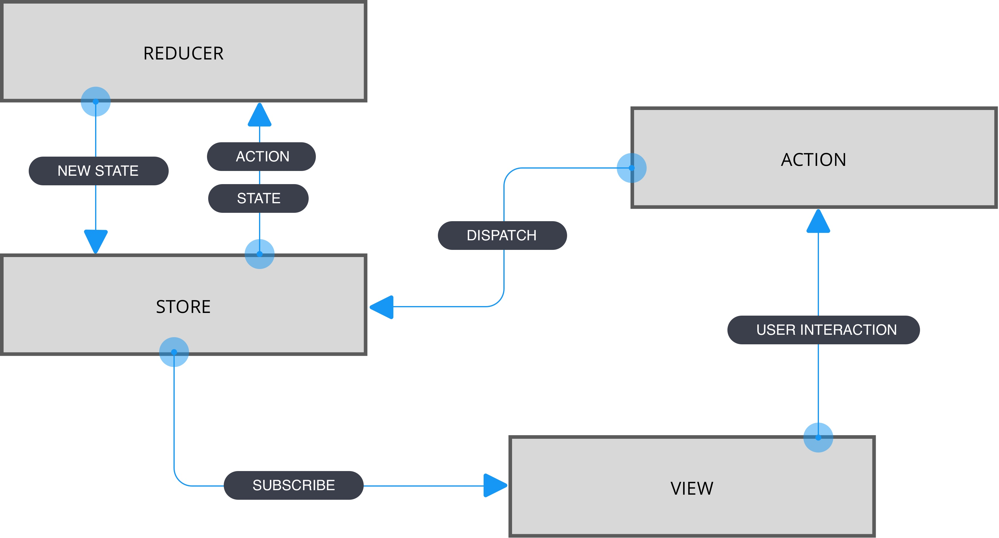

# REDUX

## Notions nécessaires
- MVC
- Reducer

## Nouvelles notions
- [Redux](https://www.npmjs.com/package/redux)
- [React-Redux](https://www.npmjs.com/package/react-redux)
- createStore


### flux


### redux : Reducer + Flux


## Codes a tester

### Dans `index.js`

```
import React from 'react';
import ReactDOM from 'react-dom';
import store from './app/store';

// état initial
console.log('state init', store.getState());

// Dispatcher des données pour une action
store.dispatch({
  type : 'ADD_QUESTION',
  question : "Comment compiler React ?"
});


// Le store a changé son state
console.log('new state', store.getState());

ReactDOM.render(<React.StrictMode><App /></React.StrictMode>,document.getElementById('root'));

```

### Dans `store.js`

```
import { createStore } from 'redux';

// Définition de la source de vérité
let stateInit = {
  count : 0,
  questions : []
}

// Définition du Reducer
let questionsReducer = (state = stateInit, action = {}) => {
  // gestion des actions du Reducer
  switch(action.type){
    case 'ADD_QUESTION':
      let questions = {
          questions : [ ...state.questions, action.question],
          count : state.count + 1
      };
      // Attention il ne faut pas faire muter vos objets, vous devez retourner
      // une copie du state modifié :
      return { ...state, ...questions };
      // Si aucun changement de state
    default:
      return state;
  }
}
//Creation du store
let store = createStore(questionsReducer);


export default store;

```
